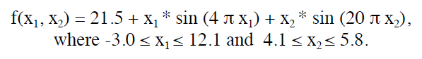

# es_func_opt_2
Evolutionary strategy algorithm for function optimizing.

(30, 200)-ES terminated after 200000 function evaluations or when an optimum has been found. The goal is to optimize the function with a precision of 4 decimal places for each variable:

using the evolutionary strategy. The population consists of possible solutions (combinations) of xi and sigma: the number which controles the rate of mutation and mutates itself.
